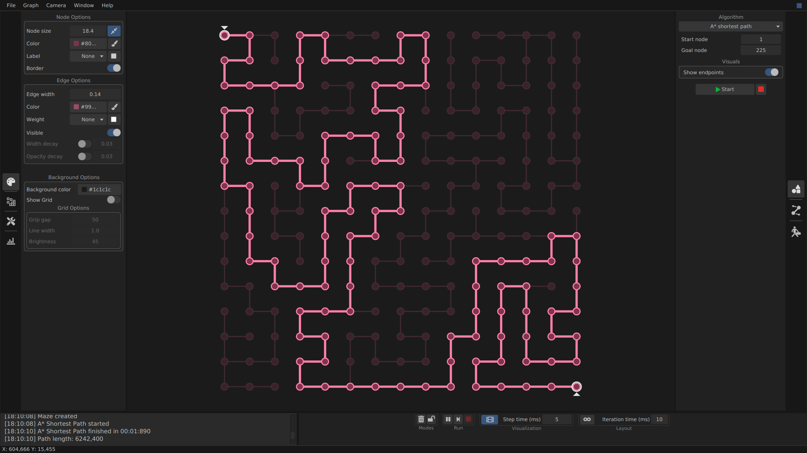
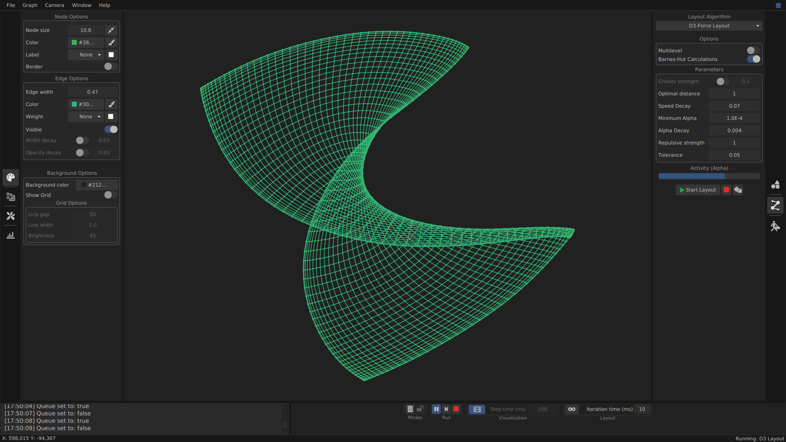

# OmniGraph
A multiplatform desktop application that lets you build graphs and visualize a collection of algorithms. Build in JavaFX.


## Features Overview

* Interactive graph editor
* Classic algorithms step-by-step visualization
* Graph layout algorithms
* Travelling salesman problem solvers
* Random & preset graph generators
* Graph export & import

## How To Run
OmniGraph runs on Windows, Linux and macOS - Java 11+ is required.

Download and run the app with jar file from the [latest release](https://github.com/Todense/OmniGraph/releases/latest),

or clone & run with maven:
```
git clone https://github.com/Todense/OmniGraph.git
cd OmniGraph
mvn clean javafx:run
```


## Features

### Basic algorithms

Step-by-step visualizations for basic algorithms, including:

* DFS
* BFS
* Dijkstra's shortest path algorithm
* A* shortest path algorithm
* Prim's minimum spanning tree algorithm
* Kruskal's minimum spanning tree algorithm
* Hamilton cycle search algorithm




### Layout algorithms

Layout algorithms aims to create readable graph drawing by arranging node positions.

Currently, OmniGraph has two force-based layout algorithms:

* Adaptive cooling force-directed layout by Yifan Hu [[1]](#1)
* D3-Force Layout algorithm [[2]](#2)

Both algorithms are dynamic, meaning graph can be changed by user while algorithm is running.

For larger graphs, it is best to use Barnes-Hut algorithm which speeds up computations.
Also, better layout could be achieved by using multilevel variants which include graph prolongation step between layouts step
(see section 5 of [[1]](#1)).




### Travelling salesman problem solvers

Current algorithms for solving TSP are several variants of [ant colony optimization technique](https://en.wikipedia.org/wiki/Ant_colony_optimization_algorithms) for TSP based on [[3]](#3):

* Ant System
* Ant Colony System
* Ranked Ant System
* Max-Min Ant System

Parameters of solvers can be tweaked while algorithms are running. 
Options for visualization include moving ants and pheromone levels animations.


### Generators

Graph generators include both random graph models and pre-defined collections of graphs (e.g. cycles, grids)

Random generators:
* Erdős–Rényi model
* Barabási–Albert model
* Geometric model
* Randomized geometric model
* Maze generator


### Saving & importing graphs

Supported file formats:
* .ogr - OmniGraph custom format (save node positions, node labels, edge weights and colors)
* .tsp -  [TSPLIB](http://comopt.ifi.uni-heidelberg.de/software/TSPLIB95/) format for the travelling salesman problem (only EUC_2D edge weight type)
* .mtx - [Matrix Market](https://math.nist.gov/MatrixMarket/) format (save structure of a graph)
* .graphml - [GraphML](http://graphml.graphdrawing.org/) format (save node positions)


## Build with

* Java 11
* [OpenJFX](https://openjfx.io/)
* [Maven](https://maven.apache.org/) - dependency management
* [Scene Builder](https://gluonhq.com/products/scene-builder/) - visual layout tool for JavaFX Applications
* [MvvmFX](https://github.com/sialcasa/mvvmFX) - an application framework for implementing the Model-View-ViewModel Pattern for JavaFX
* [ControlsFX](https://github.com/controlsfx/controlsfx) - custom JavaFX controls
* [JFoenix](https://github.com/jfoenixadmin/JFoenix) - JavaFX material design library
* [Ikonli](https://github.com/kordamp/ikonli) - icon packs for Java applications
* [JUnit 5](https://junit.org/junit5/) - Java testing framework
* CSS


## References

<a id="1">[1]</a>
Hu, Yifan. (2005). Efficient and High Quality Force-Directed Graph Drawing. Mathematica Journal. 10. 37-71.

<a id="2">[2]</a>
M. Bostock. (2011) Force-directed Graph Layout Using Velocity Verlet Integration. https://github.com/d3/d3-force

<a id="3">[3]</a>
St, Thomas & Dorigo, Marco. (1999). ACO Algorithms for the Traveling Salesman Problem.


